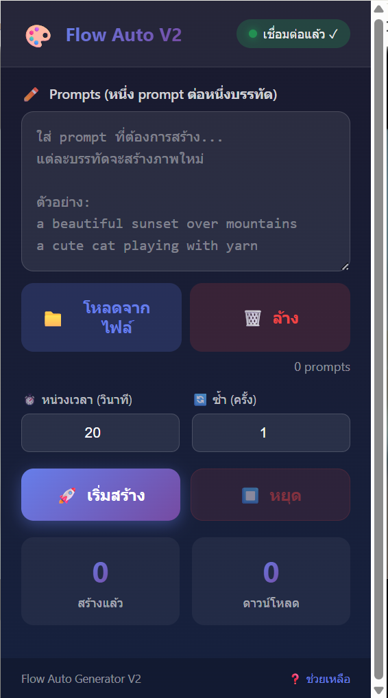

# 🎨 Flow Auto V2 (Chrome Extension)

**Flow Auto V2** คือเครื่องมือช่วยสร้างภาพ AI แบบอัตโนมัติ (AI Image Generation Automation) บน Google Chrome ช่วยให้คุณรันคำสั่ง Prompt จำนวนมากได้อย่างต่อเนื่องโดยไม่ต้องเฝ้าหน้าจอ พร้อมฟีเจอร์การตั้งค่าหน่วงเวลาและวนซ้ำที่ยืดหยุ่น

*(หน้าต่างควบคุมหลักของโปรแกรม Flow Auto V2)*

---

## ✨ ฟีเจอร์หลัก (Key Features)

โปรแกรมถูกออกแบบมาเพื่อเพิ่มประสิทธิภาพในการทำงาน (Workflow Efficiency) ดังนี้:

* **📝 Batch Prompting:** รองรับการใส่ Prompt ทีละหลายบรรทัด (หนึ่ง Prompt ต่อหนึ่งบรรทัด) ระบบจะรันทีละคำสั่งตามลำดับ
* **📂 Load from File:** สามารถนำเข้า Prompt จากไฟล์ข้อความ (`.txt`) ได้ทันทีด้วยปุ่ม "โหลดจากไฟล์" ไม่ต้องเสียเวลา Copy-Paste
* **⏱️ Smart Delay:** ตั้งค่า "หน่วงเวลา" (Delay) เป็นวินาทีระหว่างการสร้างแต่ละภาพได้ เพื่อป้องกันการถูกบล็อกหรือระบบทำงานหนักเกินไป
* **🔄 Loop & Repeat:** กำหนดจำนวนรอบการ "ซ้ำ" (Repeat) ได้ หากต้องการสร้างภาพเดิมซ้ำหลายครั้ง
* **📊 Live Statistics:** มีหน้าจอ Dashboard แสดงสถานะการทำงานแบบ Real-time:
    * **สร้างแล้ว:** นับจำนวนภาพที่สั่งเจนไปแล้ว
    * **ดาวน์โหลด:** นับจำนวนภาพที่บันทึกสำเร็จ
* **⏯️ Easy Control:** ควบคุมการทำงานได้ดั่งใจด้วยปุ่ม "เริ่มสร้าง" และ "หยุด" พร้อมสถานะแจ้งเตือนการเชื่อมต่อ (Connected) ที่มุมขวาบน

---

## ⚙️ การติดตั้ง (Installation)

เนื่องจากเป็นส่วนเสริมสำหรับนักพัฒนา (Developer Mode) ให้ทำตามขั้นตอนนี้:

1.  **ดาวน์โหลด:** ดาวน์โหลดไฟล์ Source Code และแตกไฟล์ (Extract) ออกมาเป็นโฟลเดอร์
2.  **เปิด Chrome Extensions:**
    * พิมพ์ `chrome://extensions/` ในช่อง URL
    * หรือไปที่ `Menu` > `Extensions` > `Manage Extensions`
3.  **เปิด Developer Mode:** เลื่อนสวิตช์ **"Developer mode"** ที่มุมขวาบนให้เป็น **ON**
4.  **ติดตั้ง:**
    * กดปุ่ม **"Load unpacked"** (มุมซ้ายบน)
    * เลือกโฟลเดอร์ที่แตกไฟล์ไว้
    * ไอคอน **Flow Auto V2** จะปรากฏบนแถบเครื่องมือ Chrome

---

## 🚀 วิธีการใช้งาน (User Guide)

1.  **เตรียม Prompt:** พิมพ์คำสั่งที่ต้องการในช่องข้อความ (แยกบรรทัดละ 1 คำสั่ง) หรือกดปุ่ม 📂 **โหลดจากไฟล์**
2.  **ตั้งค่า:**
    * **หน่วงเวลา:** ใส่เวลาที่ต้องการหยุดพักหลังจบแต่ละภาพ (แนะนำ 20 วินาทีขึ้นไปเพื่อความเสถียร)
    * **ซ้ำ:** ใส่จำนวนครั้งที่ต้องการให้ทำซ้ำต่อ 1 Prompt (ค่าเริ่มต้นคือ 1)
3.  **เริ่มทำงาน:** กดปุ่ม 🚀 **เริ่มสร้าง** สีม่วง
4.  **ติดตามผล:** ดูตัวเลขที่ช่อง "สร้างแล้ว" และ "ดาวน์โหลด" เพื่อเช็คความคืบหน้า
5.  **การหยุด:** หากต้องการยกเลิกกลางคัน ให้กดปุ่ม ⏹️ **หยุด** สีแดง

---

## 🛠 Troubleshooting (การแก้ปัญหาเบื้องต้น)

* **สถานะไม่ขึ้น "เชื่อมต่อแล้ว":** ให้ลองกดรีเฟรชหน้าเว็บ AI ที่คุณใช้งาน 1 ครั้ง แล้วเปิดส่วนเสริมใหม่อีกที
* **ปุ่มโหลดไฟล์ไม่ทำงาน:** ตรวจสอบว่าไฟล์ Prompt เป็นไฟล์ Text (`.txt`) ธรรมดา และมีการเว้นบรรทัดที่ถูกต้อง

---

## 📄 License
Developed for personal use and automation testing.
